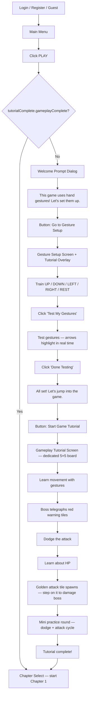

# Tutorial System — Implementation Plan

## Overview

A **three-phase tutorial system** that activates for first-time players (guests or newly registered accounts). When the user clicks **Play** for the first time, they are greeted with a welcome prompt, guided through gesture setup with testing, and then dropped into a scripted gameplay tutorial on a dedicated 5×5 board before unlocking Chapter Select.

### Core Principle

> The tutorial ONLY appears once — on the player's very first time clicking Play. After completion (or skip), it never shows again unless the player manually replays it from Settings.

---

## User Flow Diagram



---

## Phase 0: Welcome Prompt (Pre-Tutorial)

> Shown as a **full-screen dialog overlay** on top of Main Menu when the player clicks Play for the first time.
> This is NOT a separate screen — it's a `DialogueBox` spawned by `MainMenu.js`.

### Purpose

Tell the player that this game is controlled with **hand gestures via webcam**, and that they need to train their gestures before playing.

### Step-by-Step Flow

| Step | Dialog Text | Buttons | Advance Condition |
|------|-------------|---------|-------------------|
| 1 | "Welcome to **Bata, Takbo!** This game is controlled with your hand gestures through your webcam. Before you play, we need to set up your gestures so the game knows how you move!" | **Next** | Button click |
| 2 | "You'll train 5 gestures — UP, DOWN, LEFT, RIGHT, and REST. It only takes a minute! Ready?" | **Go to Gesture Setup** / Skip Tutorial | Button click |

### Behavior

- **"Go to Gesture Setup"** → navigates to `gesture-training` screen (which auto-starts the gesture tutorial overlay)
- **"Skip Tutorial"** → sets `tutorialComplete.gameplayComplete = true`, saves, navigates to `chapter-select`
- If `gestureModelTrained` is already `true` (user trained gestures from the menu before clicking Play), skip directly to Phase 2 (Gameplay Tutorial)

### Technical Notes

- Implemented in `MainMenu.js` `onEnter()` — when Play is clicked and tutorial not complete, spawn `DialogueBox` on `#screen-container` instead of navigating
- After the welcome prompt, navigate to `gesture-training` which will detect `tutorialComplete.gestureComplete === false` and auto-start the gesture tutorial overlay

---

## Phase 1: Gesture Setup Tutorial

> Triggered when user arrives at the Gesture Setup screen and `tutorialComplete.gestureComplete === false`.
> Uses the existing `GestureTraining.js` screen with a guided `TutorialManager` pop-up overlay on top.
> The overlay **wraps/augments** the existing UI — it does NOT replace it.

### Step-by-Step Flow

| Step | Pop-Up Text | Action Required | Advance Condition |
|------|-------------|-----------------|-------------------|
| 1 | "This is your camera view. Make sure your hand is clearly visible inside the frame!" | Camera should be active | Click **"Got it"** |
| 2 | "These are the gesture direction buttons. Select a direction before recording." | Look at direction buttons | Click **"Next"** |
| 3 | "Let's train the **UP** gesture. Make a clear upward hand signal, then press and hold the **Record** button until the bar fills." | Hold Record for UP | `counts.up >= 10` (auto-advance via `gesture:sampleAdded`) |
| 4 | "Great! Now do the same for **DOWN**. Make a downward signal and hold record." | Hold Record for DOWN | `counts.down >= 10` |
| 5 | "Now point **LEFT**." | Hold Record for LEFT | `counts.left >= 10` |
| 6 | "And point **RIGHT**." | Hold Record for RIGHT | `counts.right >= 10` |
| 7 | "One more — make your **REST** pose. This is what your hand looks like when you're NOT moving (e.g., an open palm or fist)." | Hold Record for IDLE | `counts.idle >= 10` |
| 8 | "Perfect! Let's test it. Click **'Test My Gestures'**, move your hand, and see if the arrows highlight correctly." | Enter test mode and test | Click **"Done Testing"** |
| 9 | "You're all set! Your gesture model has been saved. Let's jump into the game!" | Ready to proceed | Click **"Start Game Tutorial"** → navigate to `tutorial-screen` |

### Auto-Advance Logic

- Steps 3–7 listen to `gesture:sampleAdded` events from `state`. When the `TutorialManager.update('sampleAdded', counts)` is called and the relevant count reaches ≥10, the step auto-advances.
- Each step's `onEnter` callback auto-clicks the relevant direction button (e.g., `el.querySelector('#dir-down').click()`) so the user doesn't have to.

### UI Design

- **Pop-up position:** `top` of screen (so it doesn't cover the camera view or record button at the bottom)
- **Style:** Dark glass panel, same `VCR` monospace font, orange/gold accent border
- **Portrait:** Player character sprite (Chapter 1 idle frame, `/assets/characters/player/idle/idle-1.png`)
- **Highlight system:** The current target element (e.g., `#btn-record`, `#dir-up`) gets a `tutorial-highlight` CSS class (glowing orange border/pulse animation)
- **Skip button:** Every step has a subtle "Skip Tutorial" button
- **Buttons:** Reuse `.menu-btn` class

### On Completion

1. `gestureController.saveModel()` is called
2. `tutorialComplete.gestureComplete = true` is saved to state + localStorage
3. Camera is stopped
4. Navigate to `tutorial-screen` (NOT `game-screen`)

### On Skip

1. Same as completion — saves model, marks gesture tutorial done
2. Navigate to `chapter-select` (skips gameplay tutorial too)

---

## Phase 2: Gameplay Tutorial

> A **dedicated tutorial board** — uses the Chapter 1 map and boss assets but runs as a fully scripted encounter.
> The player CANNOT die (high HP), and the boss CANNOT die (frozen HP). All attacks are scripted, not random.
> This is rendered by `TutorialScreen.js`, which wraps `GameScreen` with `isTutorial: true`.

### What the Player Learns

1. **How to move** on the 5×5 grid using their trained hand gestures
2. **How boss attacks work** — red warning tiles telegraph where danger is coming
3. **How to dodge** — move off the red tiles before the attack lands
4. **How damage works** — standing on an exploding tile = HP loss
5. **How to attack the boss** — step on the golden "attack tile" to deal damage
6. **Putting it all together** — a short practice round combining dodge + attack

### Step-by-Step Flow

| Step | Pop-Up Text | Game State | Advance Condition |
|------|-------------|------------|-------------------|
| 0 | "Welcome to the battlefield! This is a 5×5 grid. You stand on it and must dodge the boss's attacks." | Game loads. Boss HP frozen. No attacks firing. Timer paused. | 4s auto-advance |
| 1 | "See your character? Use your hand gestures to move. Try going **↑ UP**!" | Waiting for UP input | Player moves UP |
| 2 | "Nice! Now try **↓ DOWN**." | Waiting for DOWN input | Player moves DOWN |
| 3 | "Good! Try **← LEFT**." | Waiting for LEFT input | Player moves LEFT |
| 4 | "Almost there — try **→ RIGHT**!" | Waiting for RIGHT input | Player moves RIGHT |
| 5 | "Great! Move freely for a bit — get comfortable with the controls." | Free movement, no boss attacks | 6s auto-advance |
| 6 | "The boss will attack you! Watch the **red warning tiles** — they show where danger is coming." | Boss performs a single slow telegraph (one row lights up red), then fires | `tutorial:attackComplete` event |
| 7 | "**DODGE!** Move away from the red tiles before the attack hits!" | Boss performs another simple attack (one column) with extra-long telegraph | `tutorial:attackComplete` event |
| 8 | "If you stand on a tile when it explodes — you take damage! Watch your health bar at the bottom." | Boss performs a third scripted attack (checkerboard or L-shape), HP bar highlighted | `tutorial:attackComplete` event |
| 9 | "Now it's YOUR turn! See the glowing **golden tile**? Step on it to damage the boss!" | A golden attack tile spawns on the grid. No boss attacks. | `tutorial:bossDamaged` event (player stepped on golden tile) |
| 10 | "Let's put it together! Dodge the boss attacks, then step on the golden tile when it appears." | Boss attacks cycle (2–3 attacks), then a golden tile spawns. Repeat once. | `tutorial:bossDamaged` event (second golden tile hit) |
| 11 | "You're ready for the real action! Good luck, warrior!" | Game freezes. Celebration particles/flash effect. | Click **"▶ Begin Adventure"** → navigate to Chapter Select |

### Scripted Boss Behavior

| Parameter | Tutorial Value | Normal Value |
|-----------|---------------|--------------|
| **Boss HP** | 999999 (invincible) | Normal Chapter 1 HP |
| **Player HP** | 5 hits (very forgiving) | Normal (usually 3) |
| **Telegraph speed** | 2× slower (doubled warning time) | Normal speed |
| **Attack patterns** | Only 2–3 simplest Ch1 patterns (single row, single column, small checkerboard) | Full random pool |
| **Attack trigger** | Scripted per step via `tutorial:triggerAttack` event | Timer/AI driven |
| **Golden tile** | Spawned via `tutorial:spawnDamageTile` event | Normal game logic |

### Event Wiring

```
GameScene / Boss listens to:
  - tutorial:triggerAttack  (stepIndex) → fires a scripted simple attack
  - tutorial:spawnDamageTile            → spawns a golden tile on the grid

GameScene / Boss emits:
  - tutorial:attackComplete             → the current scripted attack finished
  - tutorial:bossDamaged                → player stepped on the golden tile

Player emits:
  - player:moved (direction)            → used to detect UP/DOWN/LEFT/RIGHT for steps 1-4
```

### UI Design

- **Dialogue box:** Same dark glass panel as gesture tutorial, positioned at `bottom`
- **Portrait:** Player character idle sprite on the left
- **Arrow overlays:** When teaching a specific direction (steps 1–4), a large semi-transparent arrow points in that direction over the grid
- **Progress indicator:** Subtext shows `Step X / 11` at the bottom of the dialogue
- **Skip button:** Always visible as a subtle button on every step
- **"Begin Adventure" button:** Final step uses a styled `.menu-btn` instead of auto-advance

### On Completion

1. `tutorialComplete.gameplayComplete = true` saved to state + localStorage
2. Phaser game instance destroyed
3. Navigate to `chapter-select` — Chapter 1 is unlocked and ready to play

### On Skip

- Same state updates as completion (marks tutorial done)
- Navigates directly to `chapter-select`

---

## Pop-Up Dialogue Component (`DialogueBox.js`)

> Reusable across all tutorial phases. Already implemented.

### Props / Config

```js
{
  text: "Welcome to Bata, Takbo!",       // Main dialogue text
  subtext: "Step 1 / 11",                // Optional smaller text below
  portrait: "/assets/ui/guide.png",       // Optional left-side image
  buttons: [                              // Action buttons
    { label: "Next", action: "next" },
    { label: "Skip", action: "skip", style: "subtle" }
  ],
  highlight: "#dir-up",                   // CSS selector to highlight
  position: "bottom",                     // "bottom", "center", "top"
  typewriter: true,                       // Animate text typing
  hideDialogue: false,                    // Hide dialogue box (for silent steps)
  overlay: false                          // Show dark overlay behind dialogue
}
```

### Visual Style

- **Background:** `rgba(0, 0, 0, 0.85)` with `backdrop-filter: blur(4px)` — same dark glass as pause menu
- **Border:** `1px solid rgba(255, 165, 0, 0.3)` (subtle orange glow matching `--accent-orange`)
- **Text:** White, `font-family: 'VCR', monospace`
- **Buttons:** Reuse `.menu-btn` class — no custom button styles needed
- **Portrait:** Player sprite idle frame, displayed at ~64×64px on the left side
- **Typewriter effect:** Characters appear one-by-one at ~30ms intervals
- **Entry animation:** Slide up from bottom with fade
- **Highlight:** Target element gets `.tutorial-highlight` class (orange pulsing border)

---

## Gesture JSON Export / Import

> Already implemented. Added to the `GestureTraining.js` screen as Export / Import buttons.

### Export (`GestureController.js`)

```js
async exportModelJSON() {
  const data = await this.classifier.exportData();
  const blob = new Blob([JSON.stringify(data, null, 2)], { type: 'application/json' });
  const url = URL.createObjectURL(blob);
  const a = document.createElement('a');
  a.href = url;
  a.download = `bata-takbo-gestures-${Date.now()}.json`;
  a.click();
  URL.revokeObjectURL(url);
}
```

### Import (`GestureController.js`)

```js
async importModelJSON(file) {
  const text = await file.text();
  const data = JSON.parse(text);
  await this.classifier.importData(data);
  await this.saveModel();
}
```

### `GestureClassifier.js` Methods

```js
// Export all KNN training data
exportData() {
  const dataset = this.knn.getClassifierDataset();
  const data = {};
  for (const [label, tensor] of Object.entries(dataset)) {
    data[label] = Array.from(tensor.dataSync());
    data[label + '_shape'] = tensor.shape;
  }
  return data;
}

// Import KNN training data
importData(data) {
  this.knn.clearAllClasses();
  const tensors = {};
  for (const key of Object.keys(data)) {
    if (key.endsWith('_shape')) continue;
    const shape = data[key + '_shape'];
    tensors[key] = tf.tensor(data[key], shape);
  }
  this.knn.setClassifierDataset(tensors);
  this.isLoaded = true;
}
```

---

## State Management

### Tutorial State Shape

Stored as a single object under the key `tutorialComplete`:

```js
{
  gestureComplete: false,     // true after gesture setup tutorial finishes
  gameplayComplete: false     // true after gameplay tutorial finishes
}
```

### Persistence

- Stored in `localStorage` under key `bata_takbo_tutorial` via `StateManager.saveTutorialState()`
- Loaded on app startup via `StateManager._loadTutorialState()`
- For **logged-in users:** synced to server on completion (POST to `/auth/update-profile`)
- For **guest users:** `localStorage` only — resets if browser data is cleared

### Routing Logic (in `MainMenu.js`)

```js
// When Play is clicked:
const tutState = state.get('tutorialComplete') || {};
const isGestureTrained = state.get('gestureModelTrained');

if (!tutState.gameplayComplete) {
  // Tutorial not done — show welcome prompt, then route to gesture setup or tutorial
  if (isGestureTrained) {
    navigate('tutorial-screen');   // Gestures done, skip to gameplay tutorial
  } else {
    navigate('gesture-training');  // Needs gesture setup first
  }
} else {
  navigate('chapter-select');      // Tutorial done — go straight to chapters
}
```

---

## File Changes Summary

### Already Created Files ✅

| File | Purpose | Status |
|------|---------|--------|
| `web/src/screens/TutorialScreen.js` | Gameplay tutorial screen (wraps GameScreen with scripted steps) | ✅ Exists |
| `web/src/utils/TutorialManager.js` | Tutorial state machine, step progression, pop-up rendering | ✅ Exists |
| `web/src/utils/DialogueBox.js` | Reusable pop-up dialogue component with typewriter effect | ✅ Exists |

### Files That Need Modification

| File | Changes |
|------|---------|
| `MainMenu.js` | Add welcome prompt dialog when Play is clicked and tutorial not complete |
| `GestureTraining.js` | **Fix:** `_completeTutorial()` should navigate to `tutorial-screen` (not `game-screen`) |
| `GameScene.js` | Add `isTutorial` flag to disable random attacks, handle scripted `tutorial:*` events |
| `Boss.js` | Add `tutorialAttack(stepIndex)` method for scripted simple attacks + `tutorialSpawnDamageTile()` |
| `Player.js` | Emit `player:moved` direction events for tutorial step detection |
| `StateManager.js` | Already has `tutorialComplete` with `gestureComplete` / `gameplayComplete` — ✅ done |
| `index.css` | Add `.dialogue-box` styles, `.tutorial-highlight` pulse, `.tutorial-overlay` |
| `main.js` | Already registers `TutorialScreen` — ✅ done |

### Known Bug to Fix

**`GestureTraining.js` line 432:** Currently navigates to `game-screen` with `isTutorial: true` on completion. Should navigate to `tutorial-screen` instead, since `TutorialScreen.js` is the dedicated tutorial wrapper that manages the step-by-step scripted experience.

```js
// WRONG (current):
window.__screenManager.navigate('game-screen', { chapterId: 1, isTutorial: true });

// CORRECT (fix):
window.__screenManager.navigate('tutorial-screen');
```

---

## Implementation Order

### Phase 1: Foundation (✅ Done)
1. ~~Create `DialogueBox.js`~~ ✅
2. ~~Create `TutorialManager.js`~~ ✅
3. ~~Add tutorial state to `StateManager.js`~~ ✅
4. Add dialogue box CSS to `index.css` (if not already present)

### Phase 2: Welcome Prompt
5. Add welcome prompt dialog to `MainMenu.js` (Phase 0 flow)
6. Wire routing logic: Play → welcome → gesture setup OR tutorial-screen

### Phase 3: Gesture Tutorial
7. ~~Integrate tutorial overlay into `GestureTraining.js`~~ ✅
8. **Fix** `_completeTutorial()` navigation to go to `tutorial-screen`
9. Verify auto-advance logic with `gesture:sampleAdded` events

### Phase 4: Gameplay Tutorial
10. ~~Create `TutorialScreen.js` with scripted steps~~ ✅
11. Add scripted boss methods to `Boss.js` (`tutorialAttack`, `tutorialSpawnDamageTile`)
12. Add `isTutorial` mode to `GameScene.js` (disable random attacks, listen to tutorial events)
13. Add `player:moved` emission to `Player.js`
14. Add Step 10 (practice round — dodge + attack cycle)
15. Wire completion → `tutorialComplete.gameplayComplete = true` → navigate to `chapter-select`

### Phase 5: Polish
16. Add "Replay Tutorial" button to `Settings.js`
17. Add arrow overlays for directional movement steps
18. Add celebration effect on tutorial completion
19. Test full flow: Login → Main Menu → Play → Welcome → Gestures → Game Tutorial → Chapter Select

---

## Decisions (Locked In)

| # | Decision | Answer |
|---|----------|--------|
| 1 | **Guide character portrait** | ✅ Player character sprite (Ch1 idle frame) |
| 2 | **Tutorial replay** | ✅ "Replay Tutorial" button in Settings screen |
| 3 | **Keyboard fallback** | ✅ Placeholder — alternative controls TBD |
| 4 | **Guest users** | ✅ Guests see the full tutorial (localStorage only) |
| 5 | **Tutorial music** | ⏳ Leave music hooks but no track yet |
| 6 | **UI style** | ✅ Match existing game aesthetic — `.menu-btn`, `VCR` font, orange/gold accents, dark glass |
| 7 | **Welcome prompt** | ✅ Shown as a dialog overlay on Main Menu, not a separate screen |
| 8 | **Gesture → Game transition** | ✅ Navigate to `tutorial-screen` (not `game-screen`) |
| 9 | **Tutorial board** | ✅ Dedicated 5×5 board using Chapter 1 map + boss assets, fully scripted |
| 10 | **Player can't die in tutorial** | ✅ Player HP set to 5 (very forgiving), boss invincible |
| 11 | **Attack tile mechanic** | ✅ Golden tile spawns; stepping on it damages boss — taught in steps 9-10 |
| 12 | **Practice round** | ✅ Step 10 combines dodge + attack for a mini gameplay loop before finishing |
